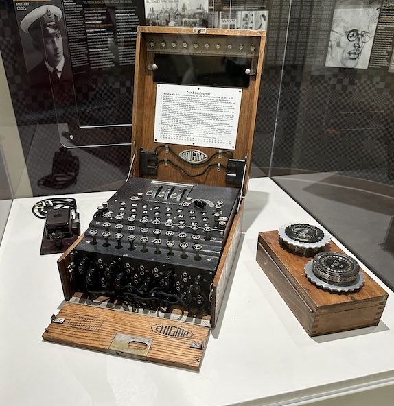

# PyEnigma

[](https://github.com/MaxAnderson95/pyenigma/actions/workflows/tests.yml) 

PyEnigma is a Python library and CLI for simulating the Enigma machine, a cipher machine used by the German military during World War II. PyEnigma simulates the Enigma model I with the model B and C reflectors, and rotors I through V.

While PyEnigma is designed as a library, it also includes a built-in CLI for easy usage and testing.

## How the Engima Machine Works

<sub>Picture taken by me of the Enigma I on display at the Computer Museum of America in Roswell, GA.<sub>



The Enigma machine translates letters using a combination of rotors, a plugboard, and a reflector. When a key corresponding to a letter is pressed, the electrical signal first passes through the plugboard, where it might be swapped with another letter if the plugboard is configured to connect those two letters. Next, the signal enters the rotors, passing through each rotor which shifts the letter based on its wiring and current position.

After passing through the rotors, the signal reaches the reflector at the end of the chain, which sends the signal back through the rotors on a different path (due to its wiring causing the letter to change again). As the signal retraces its path back through the rotors and the plugboard, it emerges as a completely different letter on the lampboard, where it is illuminated for the operator to record. The rotors advance in a ratchet-like fashion, changing the wiring paths with each key press, thus continuously altering the encryption pattern.

The Enigma machine operates in a deterministic manner, meaning that with identical settings on both sender's and receiver's machines, the same input will always produce the same output. In addition, the Enigma machine is designed to be reciprocal. Therefore, when enciphered text is input into a machine set identically to the one that encrypted it, the machine reverses the encryption process and outputs the original plaintext message.

## Installation

* Clone this repo to your local machine
* Navigate to the root of the repo on your local machine
* Run `pip install .`

## Using the CLI

PyEnigma includes a built-in CLI for easy usage and testing. The CLI can be used to encipher text using the Enigma machine with custom settings.

### Enciphering Text

```bash
> pyenigma \
    --rotors IV II I \
    --reflector C \
    --ring-settings H R Q \
    --initial-rotor-positions L F P \
    --plugboard "HR QP FZ SW EU" \
    --message "Hello World"
> CTTOJBSHRV

> pyenigma \
    --rotors IV II I \
    --reflector C \
    --ring-settings H R Q \
    --initial-rotor-positions L F P \
    --plugboard "HR QP FZ SW EU" \
    --message "CTTOJBSHRV"
> HELLOWORLD
```

## Usage as a Library

The primary classes in PyEnigma are `Rotor`, `Reflector`, `Plugboard`, and `EnigmaMachine`. These classes can be used to construct an Enigma machine and encipher text.

### Constructing a Rotor

Rotors are designated by their model (`I`, `II`, `III`, `IV`, or `V`), which describes both their internal wiring as well as their notch position. Rotors can be constructed in a number of ways, but in all cases, `ring_setting` and `initial_rotor_position` can be optionally specified by passing a single uppercase letter. If ommited, the default value is `A`.

* Pass in a rotor model to the `get_rotor` static method:

    ```python
    from pyenigma import Rotor

    my_rotor = Rotor.get_rotor(rotor_model="I", ring_setting="L", initial_rotor_position="Q")
    ```

* Use a helper function for the rotor model of your choice:

    ```python
    from pyenigma import Rotor

    my_rotor = Rotor.get_rotor_I(ring_setting="L", initial_rotor_position="Q")
    ```

* Construct the rotor by supplying the wiring and notch position yourself (this also allows you to create a custom rotor with your own wiring):

    Creating rotor model I:

    ```python
    from pyenigma import Rotor
    from pyenigma.constants import ROTOR_WIRING, ROTOR_NOTCHES

    my_rotor = Rotor(
        rotor_wiring=ROTOR_WIRING["I"],
        rotor_notch=ROTOR_NOTCHES["I"],
        ring_setting="L",
        initial_rotor_position="Q",
        rotor_model="I"
    )
    ```

    Creating a custom rotor model:

    ```python
    from pyenigma import Rotor

    my_custom_rotor = Rotor(
        rotor_wiring="ZYXWVUTSRQPONMLKJIHGFEDCBA",
        rotor_notch="N",
        ring_setting="L",
        initial_rotor_position="Q",
        rotor_model="My Custom Rotor"
    )
    ```

### Constructing a Reflector

Reflectors are also designated by their model (`B` or `C`), which describes their internal wiring. Unlike rotors, reflectors do not have the concepts of notch position, ring setting, nor initial position. Reflectors can be constructed in a number of ways, and do not have a default model:

* Pass in a reflector model to the `get_reflector` static method:

    ```python
    from pyenigma import Reflector

    my_reflector = Reflector.get_reflector(reflector_model="B")
    ```

* Use a helper function for the reflector model of your choice:

    ```python
    from pyenigma import Reflector

    my_reflector = Reflector.get_reflector_B()
    ```

* Construct the reflector by supplying the wiring yourself (this also allows you to create a custom reflector with your own wiring):

    Creating reflector model B:

    ```python
    from pyenigma import Reflector
    from pyenigma.constants import REFLECTOR_WIRING

    my_reflector = Reflector(
        reflector_wiring = REFLECTOR_WIRING["B"], 
        reflector_model="B"
    )
    ```

    Creating a custom reflector model:

    ```python
    from pyenigma import Reflector

    my_reflector = Reflector(
        reflector_wiring = "ZYXWVUTSRQPONMLKJIHGFEDCBA", 
        reflector_model="My Custom Reflector"
    )
    ```

### Constructing a Plugboard

The plugboard is represented by between 0 and 10 pairs of letters to swap. Letters can only be specified once per plugboard. Plugboard letter pairs can be added in a number of ways:

* Using the `add_connection` method:

    ```python
    from pyenigma import Plugboard

    my_plugboard = Plugboard()
    my_plugboard.add_connection("L", "R")
    my_plugboard.add_connection("Q", "E")
    my_plugboard.add_connection("N", "X")
    ```

* Using the `add_connection_from_map` method:

    ```python
    from pyenigma import Plugboard

    my_plugboard = Plugboard()
    my_plugboard.add_connection_from_map({"L": "R", "Q": "E", "N": "X"})
    ```

* Using the `add_connection_from_string` method:

    ```python
    from pyenigma import Plugboard

    my_plugboard = Plugboard()
    my_plugboard.add_connection_from_string("LR QE NX")
    ```

### Constructing an Enigma Machine and Enciphering Text

The Enigma machine is constructed by setting the rotors, reflector, and plugboard. The machine can then be used to encipher text. A list of three `Rotor` objects must be supplied, a single `Reflector`, and a single `Plugboard`. The rotors must be in the order they are placed in the machine, with the leftmost rotor being the first in the list. The plugboard must be constructed and added to the machine, but adding plugboard connections is optional. Up to 10 connections can be added to the plugboard.

The `encipher` method takes a string of text to encipher and returns the enciphered text. The `decipher` method is identical and is provided for convenience. The message to encipher will be stripped of all non-alphabetic characters and converted to uppercase before being enciphered.

```python
from pyenigma import EnigmaMachine, Rotor, Reflector, Plugboard

rotorI = Rotor.get_rotor_I(ring_setting="L", initial_rotor_position="Q")
rotorV = Rotor.get_rotor_V(ring_setting="S", initial_rotor_position="V")
rotorII = Rotor.get_rotor_II(ring_setting="H", initial_rotor_position="U")

reflectorB = Reflector.get_reflector_B()
plugboard = Plugboard()
plugboard.add_connection("F", "G")
plugboard.add_connection("L", "Q")
plugboard.add_connection("E", "H")
plugboard.add_connection("R", "W")
plugboard.add_connection("J", "K")
plugboard.add_connection("Y", "X")
plugboard.add_connection("V", "B")

enigma_machine = EnigmaMachine()
enigma_machine.set_rotors([rotorI, rotorV, rotorII])
enigma_machine.set_reflector(reflectorB)
enigma_machine.set_plugboard(plugboard)

encrypted = enigma_machine.encipher("Hello world")

print(encrypted) # Output: QQGPPDNPRQ

enigma_machine.reset()

decrypted = enigma_machine.decipher(encrypted)

print(decrypted) # Output: HELLOWORLD
```
